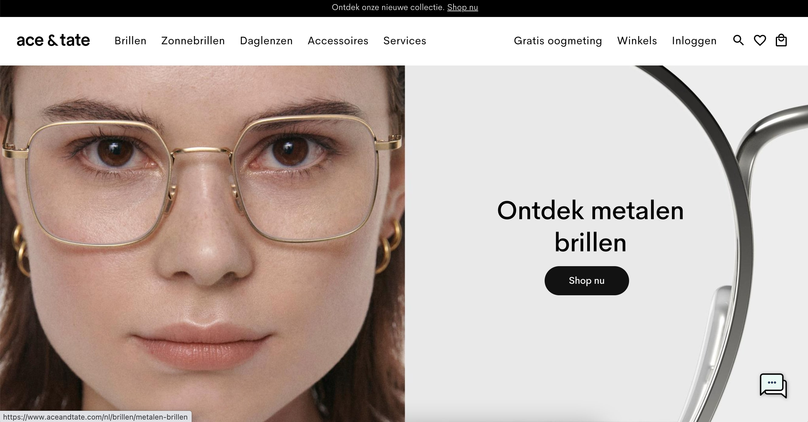
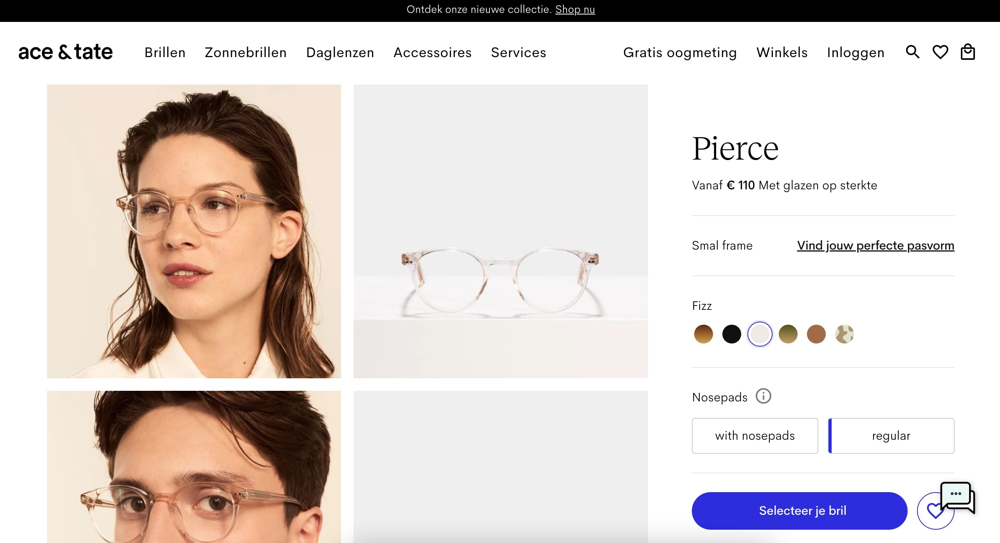

# Procesverslag
Markdown is een simpele manier om HTML te schrijven.  
Markdown cheat cheet: [Hulp bij het schrijven van Markdown](https://github.com/adam-p/markdown-here/wiki/Markdown-Cheatsheet).

Nb. De standaardstructuur en de spartaanse opmaak van de README.md zijn helemaal prima. Het gaat om de inhoud van je procesverslag. Besteedt de tijd voor pracht en praal aan je website.

Nb. Door *open* toe te voegen aan een *details* element kun je deze standaard open zetten. Fijn om dat steeds voor de relevante stuk(ken) te doen.

## Jij

  
uitwerken voor kick-off werkgroep

  ### Auteur:
  Lynn Wolters

  #### Je startniveau:
  Rood

  #### Je focus:
  Surface plane
 

## Je website

  
uitwerken voor kick-off werkgroep

  ### Je opdracht:
  https://www.aceandtate.com/nl

  #### Screenshot(s) van de eerste pagina (small screen): 
  Home Pagina 
   
  

  #### Screenshot(s) van de tweede pagina (small screen):
  Product Pagina
   
  
 

## Toegankelijkheidstest 1/2 (week 1)

  
uitwerken na test in 1e werkgroep

  Getest door: Guido Van Sark

  Site van: Lynn Wolters

  Screenreader test)

  Links
  - Alle links doen het je kan op die manier naar de content navigeren die je leuk vindt.

  Koppen
  - De zoek knop wordt niet als knop weergeven
  - De ‘shop nu’ knop wordt niet als knop weergeven
  - De chatfunctie van de site kun je niet bereiken, deze wordt niet als knop weergeven

  De formulier regelaar 
  - Deze doet het wel, je kunt je email invullen

  Orientatiepunten
  - De screenreader vertelt waar je momenteel bent
  - De kaders worden weergeven op de juiste manier
  - De navigatie doet het, alleen je kunt dus niet naar de zoekknop navigeren
  - De screenreader kan alle woorden en tekens lezen
  - De vensterspots worden weergeven door de screenreader

  Muis, toetsenbord & kleurtjes test)

  - Voor een kleurenblinde vallen de kleuren van de brillen weg, Ace & Tate heeft dit al opgelost door de naam van het type kleur erboven te laten zien. Verder valt er niks weg en kunnen kleurenblinden hier gebruik van maken.
  - Met de tabknoppen ga je langs alle kopjes en dit doet het gewoon, aan de hand van de pijtjes kun je door de gehele pagina scrollen.
  - Met de tabknop kan ik niet langs de navigatiebalk gaan en bij de “shop nu” button komen. Hij laat dan niet zien waar je je bevindt op de site.
  - Met enter kun je op het geselecteerde item klikken die een link in zich hebben.

  Diverse beperkingen test)

  Zicht
  Aan de hand van bepaalde brillen wordt het zicht op de site beperkt. de site is wordt dan ook minder goed bruikbaar. Bij Ace & Tate gebeurt het volgende: Doordat je minder zicht ervaart wordt het lastiger om bepaalde knoppen selecteren. De teksten zijn ook vaak te klein om te lezen.

  Handbeperking
  Aan de hand van bepaalde handbeperkingen is het moeilijker om op de knoppen te drukken. Ace & Tate zouden grotere knoppen moeten maken. De Afbeeldingen zijn wel groot genoeg om op te kunnen klikken.

  Spierbeperking 
  Voor mensen met een spierbeperking is het moeilijker om op een site te typen. Ace & Tate zou dus grotere knoppen kunnen maken om de gebruiker sneller te begeleiden naar zijn/haar keuze.

  Darkmode
  De optie darkmode heeft geen effect op de website van Ace & Tate.

  ADHD
  Door meerdere dingen tegelijkertijd te doen kunnen je ADHD op de site van Ace & Tate testen. Je ervaart meer afleiding door meerdere dingen tegelijkertijd te doen. Op de website van Ace & Tate zijn veel verschillende soorten afbeeldingen die kunnen worden gezien als prikkels. Dit kan tegenwerken voor mensen met ADHD, waardoor ze sneller naar een andere kledingsite kunnen navigeren.

## Breakdownschets (week 1)

  
uitwerken na afloop 2e werkgroep

  ### de hele pagina: 
  

  ### dynamisch deel (bijv menu): 
  

  ### wellicht nog een dynamisch deel (bijv filter): 
  

## Voortgang 1 (week 2)

  
uitwerken voor 1e voortgang

  ### Stand van zaken
  hier dit ging goed & dit was lastig (neem ook screenshots op van delen van je website en code)

  ### Agenda voor meeting
  samen met je groepje opstellen

  | student 1      | student 2          | student 3    | student 4        |
  | ---            | ---                | ---          | ---              |
  | dit bespreken  | en dit             | en ik dit    | en dan ik dat    |
  | en dat ook nog | dit als er tijd is | nog een punt | dit wil ik zeker |
  | ...            | ...                | ...          | ...              |

  ### Verslag van meeting
  hier na afloop snel de uitkomsten van de meeting vastleggen

  - punt 1
  - punt 2
  - nog een punt
  - ...

## Voortgang 2 (week 3)

  
uitwerken voor 2e voortgang

  ### Stand van zaken
  hier dit ging goed & dit was lastig (neem ook screenshots op van delen van je website en code)

  ### Agenda voor meeting
  samen met je groepje opstellen

  | student 1      | student 2          | student 3    | student 4        |
  | ---            | ---                | ---          | ---              |
  | dit bespreken  | en dit             | en ik dit    | en dan ik dat    |
  | en dat ook nog | dit als er tijd is | nog een punt | dit wil ik zeker |
  | ...            | ...                | ...          | ...              |

  ### Verslag van meeting
  hier na afloop snel de uitkomsten van de meeting vastleggen

  - punt 1
  - punt 2
  - nog een punt
- ...

## Toegankelijkheidstest 2/2 (week 4)

  
uitwerken na test in 8e werkgroep

  ### Bevindingen
  Lijst met je bevindingen die in de test naar voren kwamen (geef ook aan wat er verbeterd is):

  #### Screenreader
  Hier korte omschrijving (met indien nodig afbeeldingen)

  Hier een omschrijving van hoe het opgelost kan worden (met indien nodig afbeeldingen)

  #### Muis en Toetsenbord 
  Hier korte omschrijving (met indien nodig afbeeldingen)

  Hier een omschrijving van hoe het opgelost kan worden (met indien nodig afbeeldingen)

  #### Motoriek (shocks, elastiekjes)
  Hier korte omschrijving (met indien nodig afbeeldingen)

  Hier een omschrijving van hoe het opgelost kan worden (met indien nodig afbeeldingen)

  #### Visueel (brillen, contrast, kleurenblind, dark/light). 
  Hier korte omschrijving (met indien nodig afbeeldingen)

  Hier een omschrijving van hoe het opgelost kan worden (met indien nodig afbeeldingen)

## Voortgang 3 (week 4)

  
uitwerken voor 3e voortgang

  ### Stand van zaken
  hier dit ging goed & dit was lastig (neem ook screenshots op van delen van je website en code)

  ### Agenda voor meeting
  samen met je groepje opstellen

  | student 1      | student 2          | student 3    | student 4        |
  | ---            | ---                | ---          | ---              |
  | dit bespreken  | en dit             | en ik dit    | en dan ik dat    |
  | en dat ook nog | dit als er tijd is | nog een punt | dit wil ik zeker |
  | ...            | ...                | ...          | ...              |

  ### Verslag van meeting
  hier na afloop snel de uitkomsten van de meeting vastleggen

  - punt 1
  - punt 2
  - nog een punt
  - ...

## Eindgesprek (week 5)

  
uitwerken voor eindgesprek

  ### Je uitkomst - karakteristiek screenshots:
  

  ### Dit ging goed/Heb ik geleerd: 
  Korte omschrijving met plaatjes

  

  ### Dit was lastig/Is niet gelukt:
  Korte omschrijving met plaatjes

  

## Bronnenlijst

  
continu bijhouden terwijl je werkt

  Nb. Wees specifiek ('css-tricks' als bron is bijv. niet specifiek genoeg).

  1. bron 1
  2. bron 2
  3. ...

